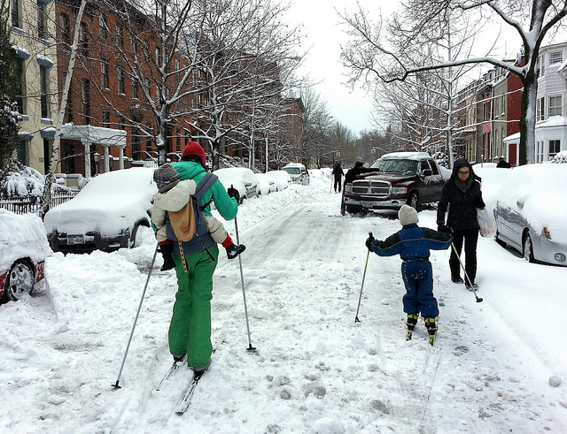
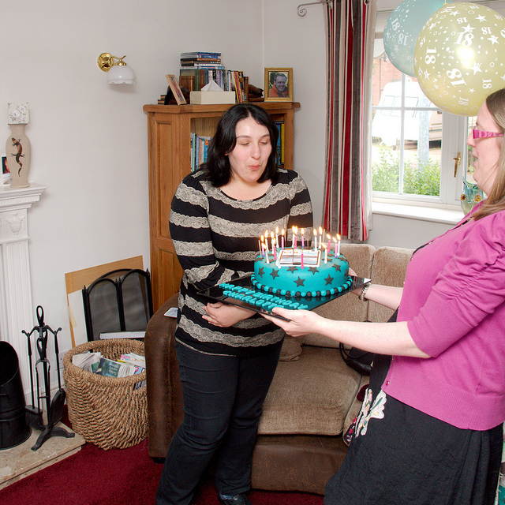
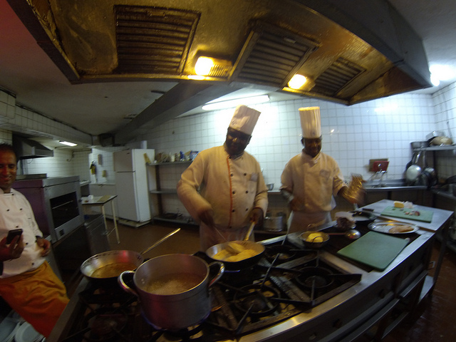
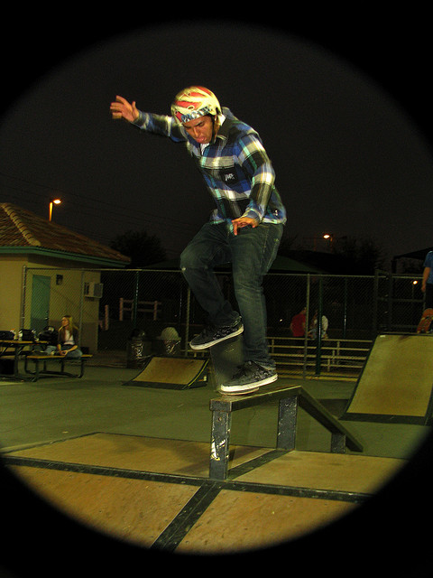

# Qualitative Examples

Four images from the MS COCO Karpathy test split (5k images) illustrating the effect of the two proposed components:

| Variant | LLM semantic-evidence **fusion** (encoder) | LLM-guided **re-ranking** (selection) |
|---|---|---|
| `CVT` | ✗ (baseline, top-1 beam candidate) | ✗ |
| `CVT-SER` | ✗ | ✓ |
| `CVT-LSE` | ✓ | ✗ (top-1 beam candidate) |
| `CVT-LSE-SER` | ✓ | ✓ (full proposed model) |

For each image below: **Generated evidence** is the object/action/relation evidence extracted from the image and converted into an LLM semantic description; **Candidate captions** are the top-5 beam-search outputs per variant; **Selected captions** are the caption each variant reports (top-1 beam candidate for `CVT`/`CVT-LSE`, LLM-selected candidate for `CVT-SER`/`CVT-LSE-SER`); **Ground truths** are the human reference captions.

---

## Example 1

| | |
|---|---|
| COCO ID | 2890 |
| Image file path | `data/coco/val2014/COCO_val2014_000000002890.jpg` |

**Generated evidence**

| Type | Value |
|---|---|
| Objects | car ×7, person ×5 |
| Actions | stand on – skis |
| Relations | ski – in – snow; track – in – snow; window – on – building |

**Candidate captions**

| Rank | CVT | CVT-LSE |
|---|---|---|
| 1 | a group of people cross country skiing | a group of people riding skis on a city street |
| 2 | a group of people cross country skiing in the snow | a group of people riding skis on a snowy surface |
| 3 | a group of people riding skis down a snow covered street | a group of people riding skis across a snow covered ground |
| 4 | a group of people skiing down a snowy street | a woman and two children cross country skiing |
| 5 | a group of people riding skis down a snow | a group of people riding skis down a snow covered street |

**Selected captions**

| Variant | Caption | Source |
|---|---|---|
| CVT | a group of people cross country skiing | top-1 beam |
| CVT-SER | a group of people skiing down a snowy street | selected from CVT candidates, rank 4 beam, LLM-selected |
| CVT-LSE | a group of people riding skis on a city street | top-1 beam |
| CVT-LSE-SER | a group of people riding skis down a snow covered street | selected from CVT-LSE candidates, rank 5 beam, LLM-selected |

**Ground truths**
1. a group of people riding skis down a snow covered street
2. a family skiing a city street while others clean snow off their cars
3. people are riding on skis in the snow on a street
4. several people going down a snowy street in skis
5. the people have there skis on in the middle of the street

---

## Example 2

| | |
|---|---|
| COCO ID | 56651 |
| Image file path | `data/coco/val2014/COCO_val2014_000000056651.jpg` |

**Generated evidence**

| Type | Value |
|---|---|
| Objects | person ×2, couch ×1, cake ×1 |
| Actions | carry – cake |
| Relations | curtain – on – window; woman – wearing – shirt; woman – wearing – pant |

**Candidate captions**

| Rank | CVT | CVT-LSE |
|---|---|---|
| 1 | a woman standing next to a cake on a table | a woman holding a birthday cake with lit candles |
| 2 | a woman holding a birthday cake in her hands | a woman holding a birthday cake with candles |
| 3 | a woman holding a cake in front of a cake | a woman is holding a birthday cake with candles |
| 4 | a woman holding a birthday cake in front of a cake | a woman holding a cake with lit candles |
| 5 | a woman holding a birthday cake in front of her hands | a woman holding a birthday cake with candles on it |

**Selected captions**

| Variant | Caption | Source |
|---|---|---|
| CVT | a woman standing next to a cake on a table | top-1 beam |
| CVT-SER | a woman holding a birthday cake in her hands | selected from CVT candidates, rank 2 beam, LLM-selected |
| CVT-LSE | a woman holding a birthday cake with lit candles | top-1 beam |
| CVT-LSE-SER | a woman holding a birthday cake with candles | selected from CVT-LSE candidates, rank 5 beam, LLM-selected |

**Ground truths**
1. a woman handing another woman a birthday cake filled with candles
2. a woman holding a blue birthday cake with stars and candles on it and another woman in front of the cake
3. a women recieves a cake that is blue
4. a fat girl blowing out candles on a cake
5. one lady is holding a birthday cake while another blows out the candles

---

## Example 3

| | |
|---|---|
| COCO ID | 103114 |
| Image file path | `data/coco/val2014/COCO_val2014_000000103114.jpg` |

**Generated evidence**

| Type | Value |
|---|---|
| Objects | person ×3, oven ×2, refrigerator ×1, cell phone ×1 |
| Actions | none |
| Relations | food – in – bowl; man – wearing – shirt; pot – on – counter |

**Candidate captions**

| Rank | CVT | CVT-LSE |
|---|---|---|
| 1 | a couple of men in a kitchen preparing food | two chefs in a kitchen cooking some food |
| 2 | two men in a kitchen preparing food | two chefs in a kitchen with pots and pans |
| 3 | two chefs preparing food in a meal | two chefs in a kitchen preparing food |
| 4 | two men in a kitchen preparing food in a meal | two chefs in a kitchen preparing food on a stove |
| 5 | a couple of men in a kitchen cooking food | two chefs in a kitchen with a stove |

**Selected captions**

| Variant | Caption | Source |
|---|---|---|
| CVT | a couple of men in a kitchen preparing food | top-1 beam |
| CVT-SER | two men in a kitchen preparing food | selected from CVT candidates, rank 2 beam, LLM-selected |
| CVT-LSE | two chefs in a kitchen cooking some food | top-1 beam |
| CVT-LSE-SER | two chefs in a kitchen preparing food on a stove | selected from CVT-LSE candidates, rank 4 beam, LLM-selected |

**Ground truths**
1. two male chefs cooking in a kitchen while another staff member uses a mobile phone
2. a kitchen with two chefs preparing food in pots
3. chefs in a restaurant cooking multiple dishes on a stove
4. two chefs in a kitchen preparing food in pans
5. chefs in uniform prepare food in a commercial kitchen

---

## Example 4

| | |
|---|---|
| COCO ID | 220187 |
| Image file path | `data/coco/val2014/COCO_val2014_000000220187.jpg` |

**Generated evidence**

| Type | Value |
|---|---|
| Objects | person ×4, skateboard ×1, bench ×1 |
| Actions | stand on – skateboard; ride – skateboard |
| Relations | man – wearing – jean; man – on – skateboard; man – wearing – helmet |

**Candidate captions**

| Rank | CVT | CVT-LSE |
|---|---|---|
| 1 | a man riding a skateboard down a ramp | a man riding a skateboard on top of a metal rail |
| 2 | a man riding a skateboard down a rail | a man riding a skateboard on a rail |
| 3 | a man riding a skateboard down the side of a ramp | a man riding a skateboard down the side of a rail |
| 4 | a young man riding a skateboard down a ramp | a man riding a skateboard on top of a wooden rail |
| 5 | a man riding a skateboard on a rail | a man riding a skateboard on top of a rail |

**Selected captions**

| Variant | Caption | Source |
|---|---|---|
| CVT | a man riding a skateboard down a ramp | top-1 beam |
| CVT-SER | a man riding a skateboard down a rail | selected from CVT candidates, rank 2 beam, LLM-selected |
| CVT-LSE | a man riding a skateboard on top of a metal rail | top-1 beam |
| CVT-LSE-SER | a man riding a skateboard on top of a rail | selected from CVT-LSE candidates, rank 5 beam, LLM-selected |

**Ground truths**
1. a man riding a skateboard on a rail at a skate park
2. a skateboarder is grinding a rail at a skatepark at night
3. a man does tricks on his skateboard on a rail
4. man wearing a helmet taking a jump with a skateboard
5. a skateboarder balances on a skateboard on a skateboarding arena at night
